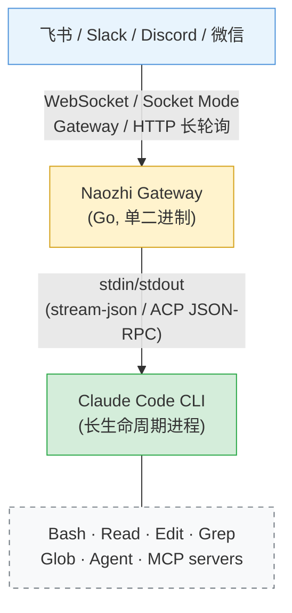
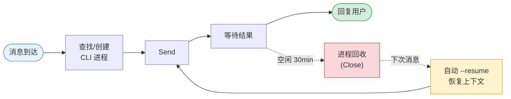
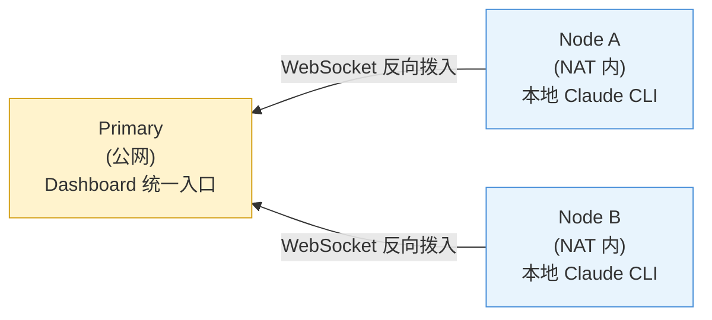

<div align="center">

# Naozhi 脑汁

**From AI Gateway to CTO Operating System**

V2.0 — 不只是 IM 聊天网关，更是你的第二大脑：知识编译、自主巡逻、审批工作流、Obsidian 集成。

[快速开始](#快速开始) · [V2.0 新功能](#v20-新功能) · [功能一览](#功能一览) · [Dashboard](#实时-dashboard) · [部署指南](#部署)

</div>

---

## V2.0 新功能

### CTO 操控台 (Home Dashboard)

打开 Dashboard 即可一眼看到全局状态：活跃 sessions、Patrol 巡逻状态、待审批项、Wiki 知识页数、今日成本。

### 知识编译 (Knowledge Compilation)

借鉴 [Karpathy LLM-Wiki](https://gist.github.com/karpathy/442a6bf555914893e9891c11519de94f) 方法论，不是 RAG，是知识编译 —— LLM 把对话/笔记/CLI 历史一次性编译成结构化 Wiki，后续直接搜索。

- **Obsidian Vault 浏览器** — 直接在 Dashboard 中查看和搜索 Obsidian 笔记，支持 wikilinks 导航、14 种 callout 样式、task checkbox (13 种)、图片渲染、折叠式 callout
- **Wiki 知识编译** — Ingest 从所有来源 (Dashboard/CLI/IM/Obsidian) 提取知识，Lint 检测矛盾和过期信息
- **统一搜索 (Cmd+K)** — 一个搜索框检索 Dashboard 对话、CLI 终端历史、Obsidian 笔记、Wiki 编译页、Bookmarks

### 自主 Agent (Autonomous Agents)

- **Patrol 巡逻** — 配置自动化 Agent 任务：PR 自动 review、AWS 成本监控、基础设施健康检查、依赖 CVE 扫描
- **Approval 审批** — Agent 在关键操作 (terraform apply, git push) 前暂停等待人工审批，支持多设备
- **Notification 通知** — 实时推送巡逻结果、审批请求、系统事件，支持 WebSocket + IM

### 对话体验升级

- **Shiki 代码高亮** — 150+ 语言语法高亮 (WASM, 按需加载)
- **工具调用卡片** — 折叠式卡片展示 Read/Edit/Bash/Grep 等工具调用
- **Diff 渲染** — Edit 工具自动渲染 inline diff (绿色新增/红色删除)
- **长输出折叠** — 超过 10 行自动折叠，渐变遮罩 + 展开按钮
- **消息 Bookmark** — 一键保存关键结论，跨 session 检索

### 高级功能

- **Knowledge Graph** — SVG 力导向图可视化知识关系网络
- **Session Replay** — 完整回放问题解决过程，可分享给团队
- **Decision Journal** — 自动生成 ADR (Architecture Decision Records)
- **CTO Digital Twin** — 基于知识库的 confidence scoring，代理回答团队问题
- **Meeting Intelligence** — 会议录音转录 + 摘要提取
- **Observability Bridge** — CloudWatch/Grafana/Datadog 告警自动根因调查

### 移动端优化

- 底部 Tab Bar (5 tabs) + Safe Area 支持
- 左滑删除 session、长按置顶
- 紧凑工具卡片 + 代码块横向滚动
- 语音按住说话 (WeChat 风格)

---

## 为什么选 Naozhi？

大多数 "AI 聊天机器人" 只是 API wrapper。Naozhi 不同 —— 它直接 spawn 本机 Claude Code CLI 作为长生命周期子进程，通过 stdin/stdout 进行原生协议通信，**保留 CLI 的全部能力**：

- 读写文件、执行 Bash、Git 操作、子 agent 编排
- 所有已配置的 MCP servers
- 自定义 system prompt 和 per-agent 模型选择



### 核心优势

| | 特性 | 说明 |
|---|---|---|
| **0** | 零基础设施 | 所有平台均支持 WebSocket / 长轮询。无需公网 IP、域名或端口转发 |
| **1** | 完整 Agent 能力 | 不是 API wrapper，是真正的 Claude Code CLI —— 工具调用、代码编辑、MCP 一个不少 |
| **2** | 会话自动恢复 | 进程崩溃/回收后自动 `--resume`，对话上下文完整保留 |
| **3** | 单二进制部署 | Go 编译，无容器、无依赖。6 平台预编译 release |
| **4** | 实时 Dashboard | 浏览器实时查看所有会话、事件流、费用统计 |
| **5** | 多节点 NAT 穿越 | 远程机器反向拨入主节点，统一管理多台工作站 |

---

## 功能一览

### IM 平台接入

| 平台 | 接入方式 | 私聊 | 群聊 | 消息编辑 |
|------|----------|------|------|----------|
| **飞书** | WebSocket 长连接 / Webhook | ✓ | ✓ | ✓ 流式更新 |
| **Slack** | Socket Mode | ✓ | ✓ (mention) | — |
| **Discord** | Gateway WebSocket | ✓ | ✓ (mention) | — |
| **微信** | HTTP 长轮询 (iLink Bot) | ✓ | — | — |

所有平台开箱即用，**无需公网 IP**。

### 多 Agent 路由

一个群聊可同时使用多个专业 agent，各自保持独立上下文：

```
/review 帮我看看这段代码有没有安全问题    → code-reviewer agent (sonnet)
/research Rust async runtime 对比分析     → researcher agent (opus)
普通消息会路由到默认 agent                 → general agent
```

Agent 命令、模型、system prompt 均可在 `config.yaml` 中自定义。

### 会话生命周期



- **Watchdog 双超时**: 无输出超时 (2min) + 总耗时超时 (5min)，防止进程挂起
- **容量管理**: 可配置最大并发进程数，满载时自动驱逐最久空闲会话
- **中断恢复**: 用户发送新消息时自动中断正在运行的 turn (SIGINT)

### 定时任务 (Cron)

在聊天中直接管理定时任务：

```
/cron add "@every 30m" 检查 staging 环境的健康状态
/cron add "0 9 * * 1-5" /review 扫描最近的 open PRs
/cron list
/cron pause <id>
```

- 标准 cron 表达式 + `@every` 语法
- 每 chat 10 个 / 全局 50 个配额
- 执行结果自动回推到聊天

### 语音转文字

发送语音消息即可与 Claude 对话。基于 Amazon Transcribe Streaming：

- 支持 OGG / FLAC / MP3 / WAV / M4A / AMR 等格式
- 不支持的格式自动通过 ffmpeg 转码为 PCM
- 多语言自动检测（可配置语言列表）
- 转码与上传并发执行，低延迟

### 项目规划器

将聊天绑定到代码项目，获得专属的 planner session：

```
/project my-app          → 绑定到 my-app 项目
普通消息自动路由到 planner → 长期上下文，不受 TTL 回收
/project off             → 解绑
```

- 自动发现 `projects_root` 下含 `CLAUDE.md` 的目录
- planner session 免驱逐、免 TTL，保持长期对话上下文
- 每个项目可配置独立的模型和 system prompt

### 实时 Dashboard

浏览器访问 `http://localhost:8180` 即可查看：

- 所有会话列表（运行中 / 就绪 / 挂起）+ 实时状态更新
- 事件流实时推送（thinking、tool_use、agent 调度、结果）
- 直接在 Dashboard 发送消息、上传文件（图片）
- 发现并接管外部 Claude CLI 进程（一键 Take Over）
- 费用统计（per-session 累计 cost）
- 项目管理（绑定配置、planner 重启）
- 定时任务管理（创建、暂停、删除）

### 多节点分布式

NAT 后面的工作站也能统一管理：



- 远程节点主动拨入 Primary 的 `/ws-node` WebSocket 端点
- Token 认证 + 自动重连（指数退避 1-30s）
- Dashboard 统一展示所有节点的会话
- 支持远程会话订阅、消息发送、进程接管

### 外部进程发现

自动扫描本机运行的 Claude CLI 进程：

- 扫描 `~/.claude/sessions/` 识别非 Naozhi 管理的 Claude 实例
- 显示会话概要（最后一条用户消息预览）
- 一键接管：SIGTERM → 等待 → `--resume` 接入 Naozhi 管理
- 自动首消息接管：检测到外部 session 时自动恢复

---

## 快速开始

### 前置条件

- [Claude Code CLI](https://claude.ai/code) 已安装并配置认证

### 安装

从 [GitHub Releases](../../releases) 下载对应平台的预编译二进制，或从源码编译:

```bash
go build -o bin/naozhi ./cmd/naozhi/
```

### 微信（两步启动）

```bash
# 1. 交互式扫码，自动获取 token 并生成配置
naozhi setup weixin

# 2. 启动
naozhi --config ~/.naozhi/config.yaml
```

需要两个微信号 —— 一个登录为 bot，另一个发消息测试。

### 飞书

1. 飞书开放平台 → 创建企业自建应用 → 开启"机器人"能力
2. 权限: `im:message`, `im:message:send_as_bot`, `im:message:patch`
3. 事件订阅: 选择 "使用长连接接收事件"，订阅 `im.message.receive_v1`
4. 发布应用版本
5. 配置凭据并启动:
   ```bash
   export FEISHU_APP_ID=your_app_id
   export FEISHU_APP_SECRET=your_app_secret
   naozhi --config config.yaml
   ```

### Slack

1. [api.slack.com/apps](https://api.slack.com/apps) → Create New App
2. 开启 Socket Mode，获取 App-Level Token (`xapp-...`)
3. Bot Token Scopes: `chat:write`, `app_mentions:read`
4. Event Subscriptions: `message.im`, `app_mention`

### Discord

1. [discord.com/developers](https://discord.com/developers/applications) → New Application → Bot
2. 开启 Message Content Intent
3. 获取 Bot Token，邀请到服务器

### 运行

```bash
naozhi --config config.yaml
```

健康检查: `curl http://localhost:8180/health`

Dashboard: 浏览器打开 `http://localhost:8180`

---

## 用户命令

| 命令 | 说明 |
|------|------|
| 普通消息 | 发送给默认 agent，保持多轮上下文 |
| `/review <text>` | 路由到 code-reviewer agent |
| `/research <text>` | 路由到 researcher agent |
| `/new` | 重置默认 agent 对话 |
| `/new review` | 重置指定 agent 对话 |
| `/cd <path>` | 切换工作目录 |
| `/pwd` | 显示当前工作目录 |
| `/project <name>` | 绑定到项目 |
| `/project off` | 解绑项目 |
| `/cron add "<schedule>" <prompt>` | 创建定时任务 |
| `/cron list` | 查看定时任务 |
| `/cron del/pause/resume <id>` | 管理定时任务 |
| `/help` | 显示可用命令 |

Agent 命令通过 `agent_commands` 配置映射，可自定义。

---

## 配置参考

```yaml
server:
  addr: ":8180"
  dashboard_token: "${DASHBOARD_TOKEN}"   # Dashboard 访问密码 (可选)
  allowed_root: "/home/user/projects"     # 限制 /cd 可访问的路径

cli:
  backend: claude                         # "claude" | "kiro"
  path: "~/.local/bin/claude"
  model: "sonnet"                         # sonnet / opus / haiku
  args:
    - "--dangerously-skip-permissions"

session:
  max_procs: 3                            # 最大并发 CLI 进程
  ttl: "30m"                              # 空闲回收超时
  watchdog:
    no_output_timeout: "2m"               # 无输出超时
    total_timeout: "5m"                   # 单轮总超时
  store_path: "~/.naozhi/sessions.json"

agents:                                   # 自定义 agent
  code-reviewer:
    model: "sonnet"
    args: ['--append-system-prompt', 'You are a code reviewer...']
  researcher:
    model: "opus"

agent_commands:                           # 命令 → agent 映射
  review: code-reviewer
  research: researcher

cron:
  store_path: "~/.naozhi/cron.json"
  max_jobs: 50
  execution_timeout: "5m"

transcribe:                               # 语音转文字 (Amazon Transcribe)
  region: "us-east-1"
  languages: "zh-CN,en-US,ja-JP"         # 多语言自动检测

projects:
  root: "/home/user/projects"             # 项目扫描根目录

reverse_nodes:                            # 多节点：接受远程拨入
  my-workstation:
    token: "${NODE_TOKEN}"
    display_name: "Kevin's Mac"

# upstream:                               # 多节点：作为远程节点拨入
#   url: "wss://primary.example.com/ws-node"
#   node_id: "my-workstation"
#   token: "${NODE_TOKEN}"

platforms:
  feishu:
    app_id: "${FEISHU_APP_ID}"
    app_secret: "${FEISHU_APP_SECRET}"
    max_reply_length: 4000
  # slack:
  #   bot_token: "${SLACK_BOT_TOKEN}"
  #   app_token: "${SLACK_APP_TOKEN}"
  # discord:
  #   bot_token: "${DISCORD_BOT_TOKEN}"
  # weixin:
  #   token: "${WEIXIN_BOT_TOKEN}"
```

环境变量通过 `${VAR_NAME}` 语法自动展开。

---

## 部署

### 本地运行

所有平台均支持 WebSocket / 长轮询，直接运行即可，**无需公网 IP**。

### 服务器部署 (systemd)

```bash
# 编译
CGO_ENABLED=0 GOOS=linux GOARCH=arm64 go build -o bin/naozhi ./cmd/naozhi/

# 上传到服务器
scp bin/naozhi server:/usr/local/bin/

# 安装 systemd service
sudo cp deploy/naozhi.service /etc/systemd/system/
sudo systemctl daemon-reload && sudo systemctl enable naozhi

# 配置凭据
cat > ~/.naozhi/env << 'EOF'
FEISHU_APP_ID=your_app_id
FEISHU_APP_SECRET=your_app_secret
DASHBOARD_TOKEN=your_dashboard_password
EOF
chmod 600 ~/.naozhi/env

# 启动
sudo systemctl start naozhi
journalctl -u naozhi -f
```

### 生产架构

```
CloudFront → ALB (SG: CloudFront-only) → EC2 :8180 → systemd
```

- ALB 安全组仅允许 CloudFront 前缀列表
- EC2 通过 IAM 角色认证 Bedrock（无 AKSK）
- 推荐 t4g.small ARM64 实例

### 发布

```bash
git tag v0.1.0
git push origin v0.1.0    # GitHub Actions 自动构建 6 平台二进制 + Release
```

---

## 项目结构

```
cmd/naozhi/              入口 + CLI 命令 (setup, install, version)
internal/
  cli/                   CLI 进程管理 + Protocol 接口 (stream-json / ACP)
  session/               Session 路由 + 并发控制 + TTL 回收 + 持久化
  server/                HTTP server + Dashboard + WebSocket hub
  platform/              IM 平台统一接口
    feishu/              飞书 (WebSocket + Webhook)
    slack/               Slack (Socket Mode)
    discord/             Discord (Gateway WebSocket)
    weixin/              微信 (iLink Bot HTTP 长轮询)
  cron/                  定时任务调度器
  project/               项目发现 + Planner 路由
  discovery/             外部 Claude 进程扫描 + 接管
  transcribe/            语音转文字 (Amazon Transcribe Streaming)
  connector/             反向连接客户端 (NAT 穿越)
  reverse/               多节点 WebSocket 协议
  routing/               命令解析
  config/                YAML 配置 + 环境变量展开
  pathutil/              路径工具
deploy/                  systemd service unit
```

## 设计文档

完整架构设计见 [DESIGN.md](docs/DESIGN.md)。

## License

[BSL 1.1](LICENSE) — 源码可读可改，个人和非生产用途免费。生产环境商用需获得授权。2030-03-21 后自动转为 Apache 2.0。
